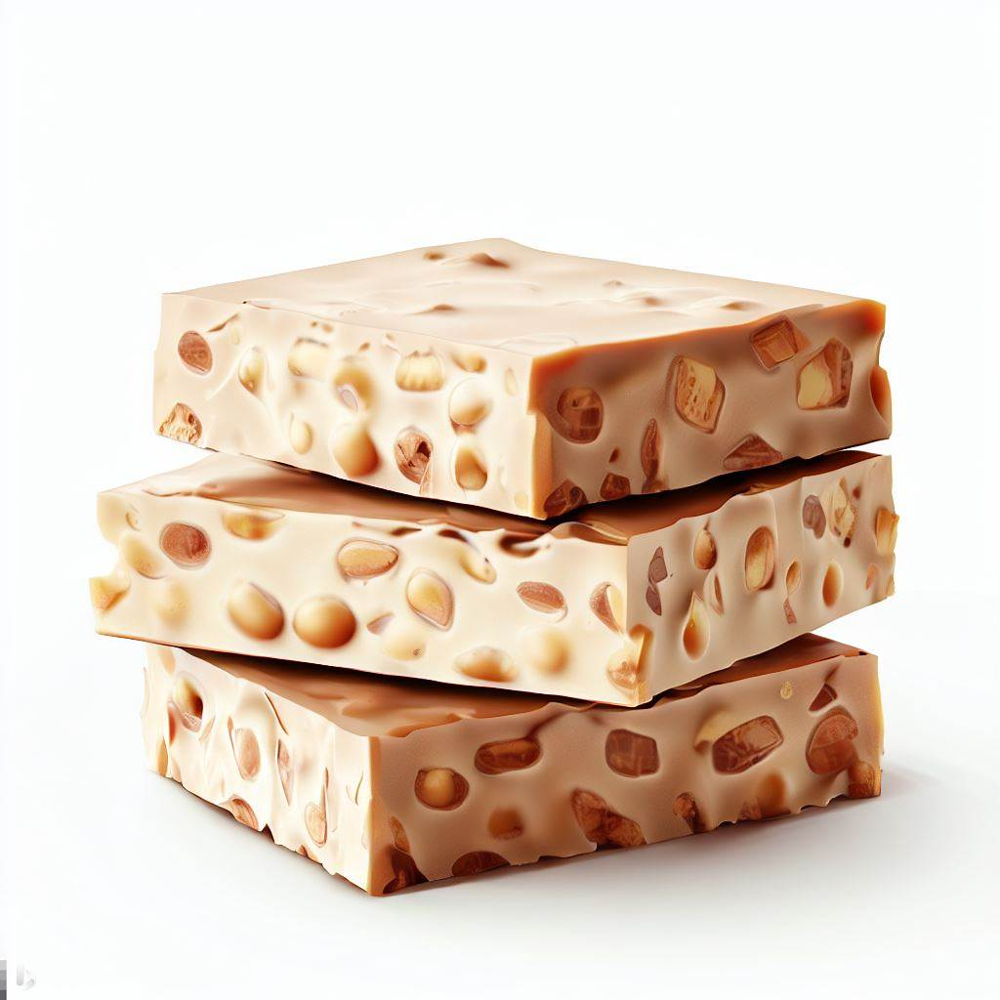

### Hi there 👋

#### The answer to the question you never intended to ask

⚡ Torró is a turron in Catalan, where I suspect my last name comes from. I couldn't resist being named after such a nice sweet, hence my pseudo Rémy the turron. 

  
Your text goes here.

  

<!--
**remyeltorro/remyeltorro** is a ✨ _special_ ✨ repository because its `README.md` (this file) appears on your GitHub profile.

Here are some ideas to get you started:

- 🔭 I’m currently working on ...
- 🌱 I’m currently learning ...
- 👯 I’m looking to collaborate on ...
- 🤔 I’m looking for help with ...
- 💬 Ask me about ...
- 📫 How to reach me: ...
- 😄 Pronouns: ...
- ⚡ Fun fact: ...
-->
